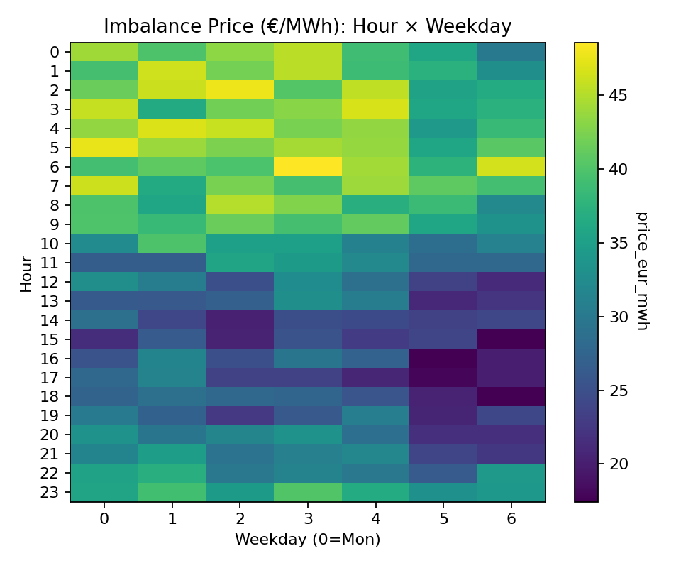
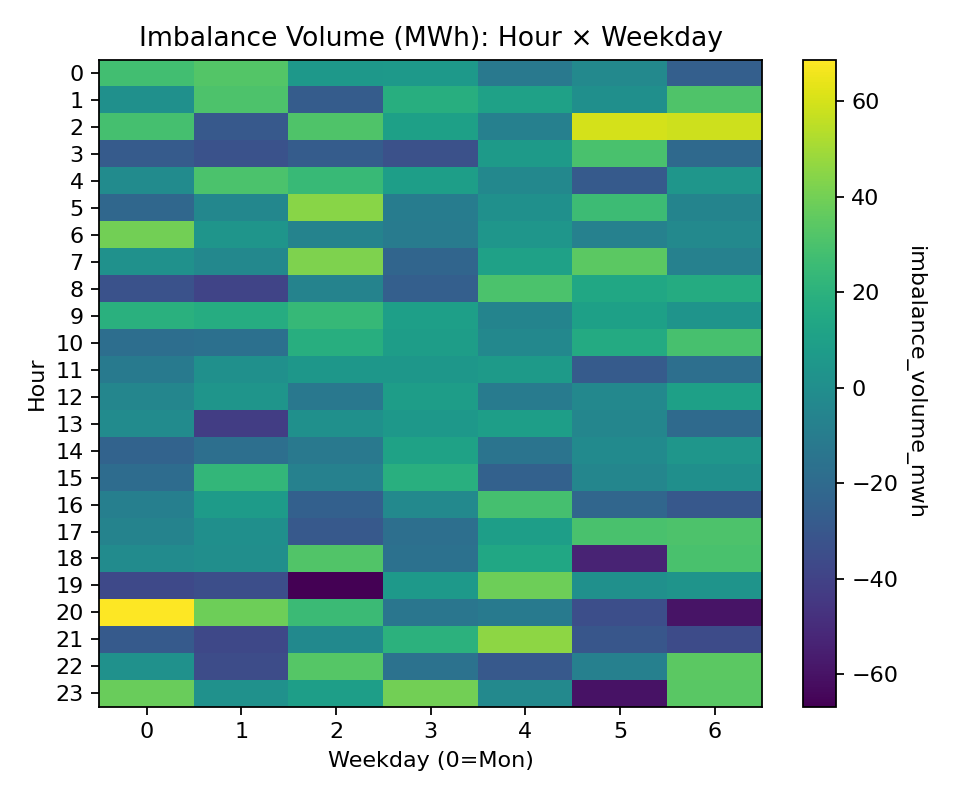
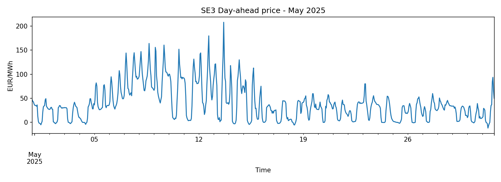
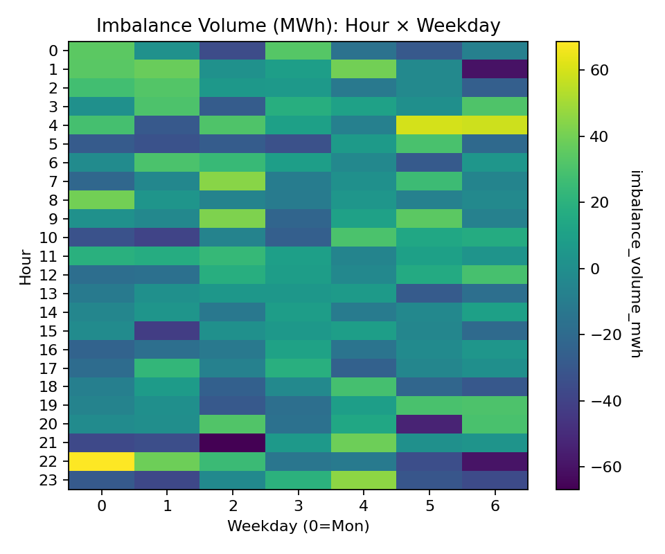
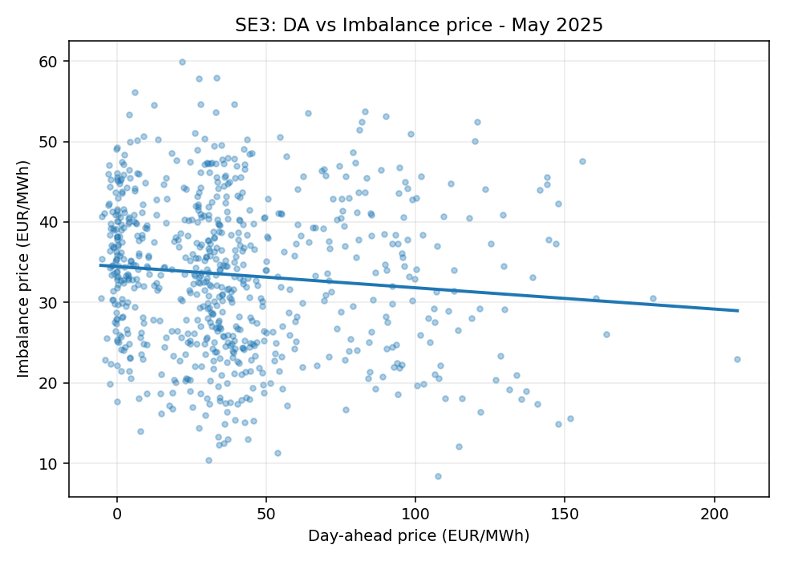
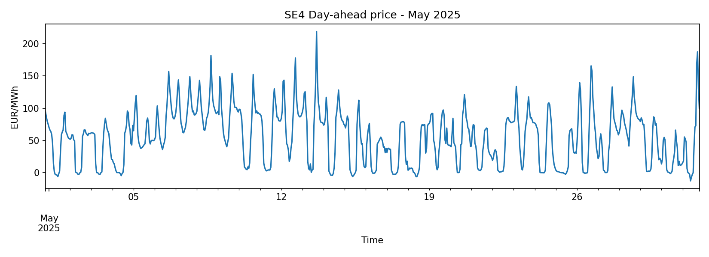
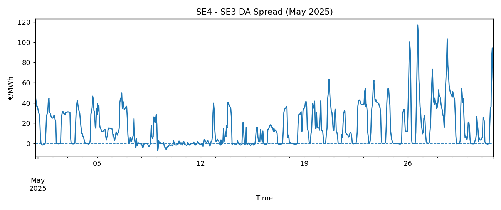
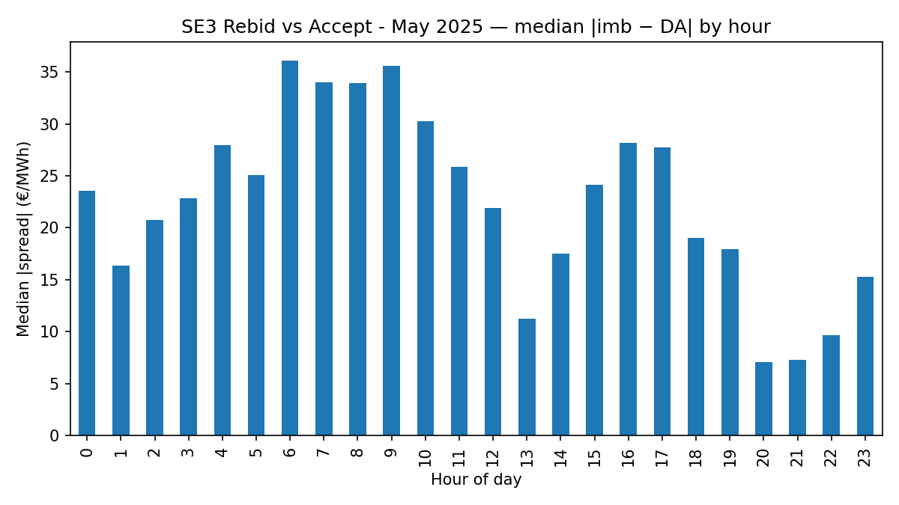
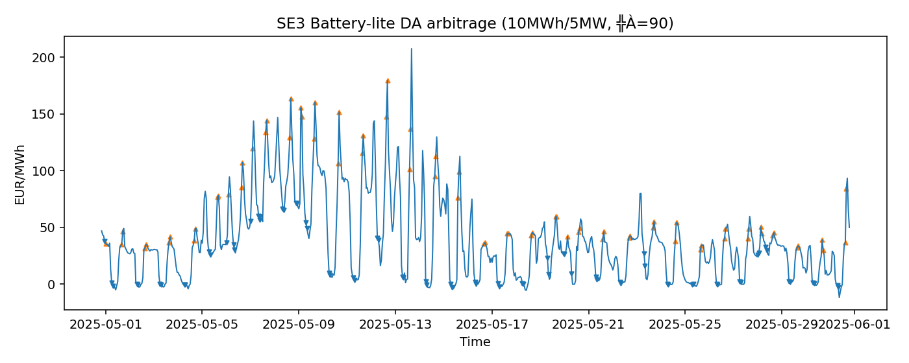
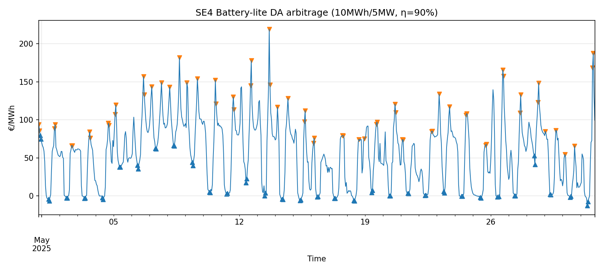

# nordic-imbalance-basics

Fetch, tidy, and visualize Nordic (SE3/SE4/FI) **imbalance prices & volumes** with hour×weekday patterns and simple deviation-risk views.

> **Why this exists:** Imbalance exposure drives intraday/VPP decisions. This repo cleans Nordic imbalance data (demo for now) and gives fast visuals to decide when to rebid vs accept deviation.

## Status — 2025-08-19

- ✅ **DA (A44)** via ENTSO-E REST is **live** → tidy Parquet  secrets in (`.env`).
- 🟡 **Imbalance (A85)** fetcher is **scaffolded**; the **demo uses converted CSVs** for now.
- ➡️ **Next:** wire A85 **XML→Parquet** for **SE3/SE4**, then extend to **FI** and update the joins/plots.
- ℹ️ Outputs target **15-minute granularity** (Nordic ISP), with one-click Windows rebuilds.


## What’s inside
- `data/` – tidy Parquet extracts (prices/volumes)
- `src/` – small Python CLIs to **fetch** and **plot**
- `reports/` – PNGs + a tiny Markdown stats file
- `notebooks/` – optional EDA later

## Quickstart (Windows, Python 3.10+)
```bat
python -m venv .venv
call .venv\Scripts\activate
pip install -r requirements.txt

REM DEMO data (synthetic) for SE3, May 2025
python src\fetch_imbalance.py --area SE3 --start 2025-05-01 --end 2025-05-31 --out data\SE3.parquet --demo

REM Heatmaps + quick stats
python src\make_heatmaps.py --input data\SE3.parquet --out reports
```
**One-click rebuilds (Windows):**  run [run_all_SE3.bat](run_all_SE3.bat) or [run_all_SE4.bat](run_all_SE4.bat) to regenerate all charts and stats.

## Outputs 

**Methods & reproducibility:** see [METHOD.md](METHOD.md) for data sources, steps, assumptions, and checks.

**Quick links:**  
[SE3 weekly report](reports/SE3/weekly_report.md) ·
[SE4 weekly report](reports/SE4/weekly_report.md) ·
[SE3 DA ↔ Imbalance (stats)](reports/SE3/da_vs_imbalance_stats.md) ·
[SE4 − SE3 spread (stats)](reports/SE3_SE4/da_spread_stats.md)

### Heatmaps — SE3 (real data)



See quick stats: [reports/SE3/stats.md](reports/SE3/stats.md)

Weekly report (one-pager): [reports/SE3/weekly_report.md](reports/SE3/weekly_report.md)

### Day-ahead price — SE3 · May 2025


See quick stats: [reports/SE3/da_price_stats.md](reports/SE3/da_price_stats.md)

<details>
<summary>Demo heatmaps (synthetic, May 2025) — optional</summary>




See quick stats: [reports/stats.md](reports/stats.md)
</details>

### DA price ↔ Imbalance price — SE3 (May 2025)



See quick stats: [reports/SE3/da_vs_imbalance_stats.md](reports/SE3/da_vs_imbalance_stats.md)

### Day-ahead price — SE4 · May 2025


See quick stats: [reports/SE4/da_price_stats.md](reports/SE4/da_price_stats.md)

### SE4 − SE3 day-ahead spread — May 2025


See quick stats: [reports/SE3_SE4/da_spread_stats.md](reports/SE3_SE4/da_spread_stats.md)

**Top moves (per day):** [reports/SE3_SE4/spread_monitor.csv](reports/SE3_SE4/spread_monitor.csv) · [summary](reports/SE3_SE4/spread_monitor.md)  
Hourly join parquet: `reports/SE3_SE4/da_spread_hourly.parquet`.

Weekly report (one-pager): [reports/SE4/weekly_report.md](reports/SE4/weekly_report.md)

### Rebid vs Accept — SE3 (May 2025)


See summary: [reports/SE3/rebid_accept_summary.md](reports/SE3/rebid_accept_summary.md)

### IDA Prep Sheet — SE3 (daily)
- CSV: [reports/SE3/ida_prepsheet.csv](reports/SE3/ida_prepsheet.csv)
- One-pager: [reports/SE3/ida_prepsheet.md](reports/SE3/ida_prepsheet.md)

### IDA Prep Sheet — SE4 (daily)
- CSV: [reports/SE4/ida_prepsheet.csv](reports/SE4/ida_prepsheet.csv)
- One-pager: [reports/SE4/ida_prepsheet.md](reports/SE4/ida_prepsheet.md)

What’s inside: per-day DA/Imbalance means & std, correlation, # of big deviation hours (|Imb−DA| > 50 €/MWh), p95 abs spread, max/min spread.

### Battery-lite DA arbitrage

#### SE3


See stats: [reports/SE3/battery_stats.md](reports/SE3/battery_stats.md)

#### SE4


Assumptions: 10 MWh cap, 5 MW power, 90% round-trip efficiency; simple DA-only rule; no fees.

See stats: [reports/SE4/battery_stats.md](reports/SE4/battery_stats.md)

**Schedule CSVs:**
- SE3 → [reports/SE3/battery_schedule.csv](reports/SE3/battery_schedule.csv)
- SE4 → [reports/SE4/battery_schedule.csv](reports/SE4/battery_schedule.csv)

## Using your own CSV (real data)
Convert any CSV to this repo’s schema, then build charts.

**Note:** Change `--area` to your zone (`SE3`/`SE4`/`FI`) to match your data.

```bat
REM 1) Convert CSV -> Parquet
python src\csv_to_parquet.py --csv data\YOUR_FILE.csv --ts-col ts --price-col price_eur_mwh --volume-col imbalance_volume_mwh --area SE3 --out data\SE3_real.parquet

REM 2) Make heatmaps + stats
python src\make_heatmaps.py --input data\SE3_real.parquet --out reports\SE3
```
**Expected columns in CSV:**
- `ts` — timestamp (with or without timezone)
- `price_eur_mwh` — numeric
- `imbalance_volume_mwh` — numeric (± for direction)

---

## ENTSO-E REST API — token & dry-run

**What this does:** fetches day-ahead prices for SE3/SE4 straight from ENTSO-E, saves to Parquet, and (optionally) plots a PNG.

**1) Token (once)**
- In your Transparency Platform account: *My Account Settings → Web API Security Token → Generate new token*.
- Save locally in `.env` (never commit):ENTSOE_TOKEN=YOUR-REAL-TOKEN


**2) Fetch & plot (example window)**
```bat
call .venv\Scripts\activate
python src\fetch_da_entsoe.py --area SE3 --start 2025-05-10 --end 2025-05-13 --out data\DA_SE3_API.parquet
python src\plot_da_api.py --input data\DA_SE3_API.parquet --out reports\SE3\da_price_api.png
```


**3) One-click (Windows)**
```bat
run_all_SE3.bat
run_all_SE4.bat
```

**Dry-run (no token needed)**
Prints the exact endpoint with your token redacted.
```bat
python src\fetch_da_entsoe.py --area SE3 --start 2025-05-10 --end 2025-05-13 --out data\DA_SE3_API.parquet --dry-run
```

### Imbalance via ENTSO-E (A85)

Prerequisite: create `.env` and set `ENTSOE_TOKEN=YOUR-REAL-TOKEN`. Do not commit `.env`.

Fetch imbalance prices for SE3 and write a join-compatible parquet:

```bat
python src\fetch_imbalance_entsoe.py --area SE3 --start 2025-08-18 --end 2025-08-19 --out data\SE3_imbalance.parquet
```

Make the DA vs Imbalance plot (uses your latest DA parquet):

```bat
python src\join_da_imbalance.py --da data\DA_SE3_API_latest.parquet --imb data\SE3_imbalance.parquet --out reports\SE3 --title "SE3 - DA vs Imbalance (API)"
```

**Output parquet schema (join-compatible)**

```
index:   ts_utc (UTC)
columns: price_eur_mwh, imbalance_volume_mwh
```

**Notes (Imbalance)**

* A85 uses the control-area EIC (not the bidding-zone EIC).
* Sweden (SE3 and SE4) control-area EIC: `10YSE-1--------K` (Svk).
* If ENTSO-E returns "No matching data" for the chosen window, the script still writes a join-compatible empty parquet so the pipeline and plots do not break.
* For SE4, change `--area SE3` to `--area SE4`.
* `--end` is exclusive; times are handled in UTC.

**Notes (Day-Ahead)**

* `--end` is exclusive (e.g., 10..13 = 72 hours).
* Times are UTC internally; results are clamped to the area’s local day (Europe/Stockholm).
* Areas supported now: SE3, SE4 (EICs wired in `src/eic_map.py`). FI support can be added later.

---

## Releases
- Latest: https://github.com/EmotionalTrader/nordic-imbalance-basics/releases
- Older demo tags:
  [v0.5.0-demo](https://github.com/EmotionalTrader/nordic-imbalance-basics/releases/tag/v0.5.0-demo) ·
  [v0.4.0-demo](https://github.com/EmotionalTrader/nordic-imbalance-basics/releases/tag/v0.4.0-demo) ·
  [v0.3.0-demo](https://github.com/EmotionalTrader/nordic-imbalance-basics/releases/tag/v0.3.0-demo) ·
  [v0.2.0-demo](https://github.com/EmotionalTrader/nordic-imbalance-basics/releases/tag/v0.2.0-demo) ·
  [v0.1.0](https://github.com/EmotionalTrader/nordic-imbalance-basics/releases/tag/v0.1.0)

## Secrets / ENTSO-E token
- Copy `.env.example` to `.env` and set your token: `ENTSOE_TOKEN=...`
- `.env` is ignored by git; never commit real tokens.

## Quickstart: Day-Ahead via ENTSO-E
1) Copy `.env.example` to `.env` and set `ENTSOE_TOKEN`.
2) Fetch demo (SE3, 2 days):
```bat
python src\fetch_da_entsoe.py --area SE3 --start 2025-08-15 --end 2025-08-17 --out data\DA_SE3_API_demo.parquet
```
3) Plot:
```bat
python src\plot_da_api.py --input data\DA_SE3_API_demo.parquet --out reports\SE3\da_api_demo.png
```
One-click (Windows):
```bat
run_all_SE3.bat
run_all_SE4.bat
```
